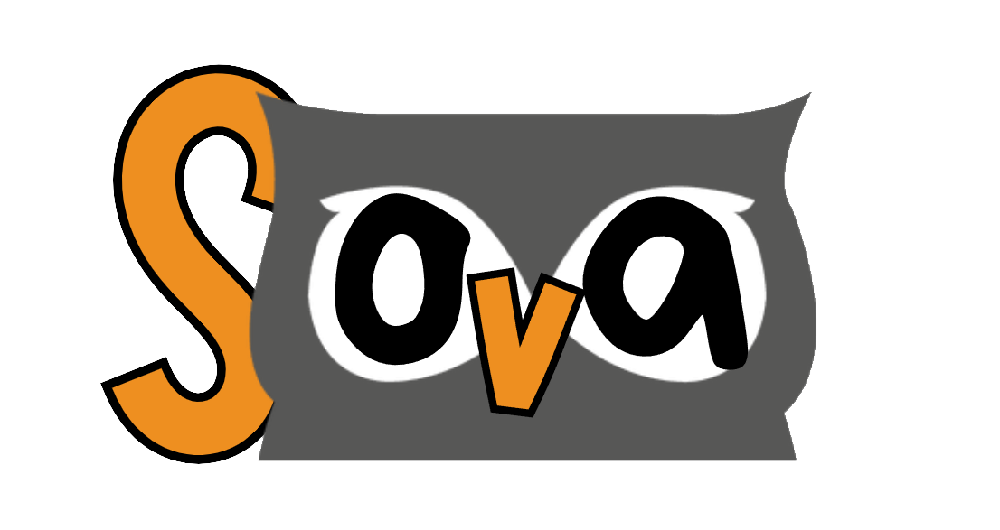
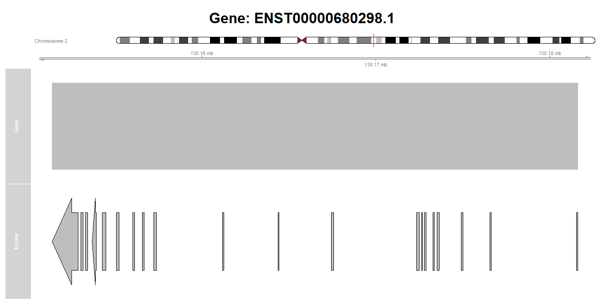

---
output:
  html_document: default
  pdf_document: default
---


# **Sova**
Scientific programming Project (R) by Flavia Leotta

## **Disclaimer**
This is a project created for purely didactic purposes, as an assignment for the Scientific Programming course held by Professor Piro Rosario Michael. The author is Flavia Leotta, a student of MSc Bioinformatics for Computational Genomics fo the University of Milan in collaboration with Politecnico of Milan. Nevertheless, the main code for Sova and all associated files are available for personal use with no restriction: citing the author is not necessary, but deeply appreciated.<br>
<br> It is free to download from my <a href="https://github.com/moonmiun/Sova" target="_blank">GitHub account</a>.
For any questions regarding Sova, feel free to contact me through the following e-mail: flavia.leotta@hotmail.com.

## **Introduction**
Sova is a R package created with the intention of handling information about Genes, by constructing virtual S4 classes of specific gene types which are inherited from a virtual gene class that represents genes in general. 


The basic functionality of the Web Service are:

- Store gene information;
- Download information from ENSEMBL;
- Convert a FASTA file in a sequence compatible with the package;
- Display gene information;
- Compute the length of the genetic products (for example, the RNA transcript or the protein encoded by the gene).


## **Directory structure**
Sova comes in a zipped file downloadable from the author's <a href="https://github.com/moonmiun/Sova" target="_blank">GitHub account</a> to be locally installed.<br>
<br>
Sova/<br>
├── DESCRIPTION.txt&nbsp;&nbsp;&nbsp;&nbsp;&nbsp;&nbsp;&nbsp;&nbsp;&nbsp;&nbsp;&nbsp;&nbsp;&nbsp;&nbsp;&nbsp;&nbsp;&nbsp;&nbsp;&nbsp;&nbsp;&nbsp;&nbsp;&nbsp;&nbsp;&nbsp;&nbsp;# Package basic description file. <br>
├── inst/&nbsp;&nbsp;&nbsp;&nbsp;&nbsp;&nbsp;&nbsp;&nbsp;&nbsp;&nbsp;&nbsp;&nbsp;&nbsp;&nbsp;&nbsp;&nbsp;&nbsp;&nbsp;&nbsp;&nbsp;&nbsp;&nbsp;&nbsp;&nbsp;&nbsp;&nbsp;&nbsp;&nbsp;&nbsp;&nbsp;&nbsp;&nbsp;&nbsp;&nbsp;&nbsp;&nbsp;&nbsp;&nbsp;&nbsp;&nbsp;&nbsp;&nbsp;&nbsp;&nbsp;&nbsp;&nbsp;&nbsp;&nbsp;&nbsp;# Folder containing images.<br>
│&nbsp;&nbsp;└── images/<br>
│&nbsp;&nbsp;&nbsp;&nbsp;&nbsp;├── classes_hierarchy.pdf&nbsp;&nbsp;&nbsp;&nbsp;&nbsp;&nbsp;&nbsp;&nbsp;&nbsp;&nbsp;&nbsp;&nbsp;&nbsp;&nbsp;&nbsp;# File showing classes hierarchy and all slots, both required and facultative ones. <br>
│&nbsp;&nbsp;&nbsp;&nbsp;&nbsp;└── logo.png<br>
├── man/&nbsp;&nbsp;&nbsp;&nbsp;&nbsp;&nbsp;&nbsp;&nbsp;&nbsp;&nbsp;&nbsp;&nbsp;&nbsp;&nbsp;&nbsp;&nbsp;&nbsp;&nbsp;&nbsp;&nbsp;&nbsp;&nbsp;&nbsp;&nbsp;&nbsp;&nbsp;&nbsp;&nbsp;&nbsp;&nbsp;&nbsp;&nbsp;&nbsp;&nbsp;&nbsp;&nbsp;&nbsp;&nbsp;&nbsp;&nbsp;&nbsp;&nbsp;&nbsp;&nbsp;&nbsp;&nbsp;&nbsp;&nbsp;# Functions documentation <br>
│&nbsp;&nbsp;└── functions.Rd<br>
├── NAMESPACE.txt&nbsp;&nbsp;&nbsp;&nbsp;&nbsp;&nbsp;&nbsp;&nbsp;&nbsp;&nbsp;&nbsp;&nbsp;&nbsp;&nbsp;&nbsp;&nbsp;&nbsp;&nbsp;&nbsp;&nbsp;&nbsp;&nbsp;&nbsp;&nbsp;&nbsp;&nbsp;&nbsp;&nbsp;&nbsp;&nbsp;# File containing the functions to export and which packages to import. <br>
├── R/&nbsp;&nbsp;&nbsp;&nbsp;&nbsp;&nbsp;&nbsp;&nbsp;&nbsp;&nbsp;&nbsp;&nbsp;&nbsp;&nbsp;&nbsp;&nbsp;&nbsp;&nbsp;&nbsp;&nbsp;&nbsp;&nbsp;&nbsp;&nbsp;&nbsp;&nbsp;&nbsp;&nbsp;&nbsp;&nbsp;&nbsp;&nbsp;&nbsp;&nbsp;&nbsp;&nbsp;&nbsp;&nbsp;&nbsp;&nbsp;&nbsp;&nbsp;&nbsp;&nbsp;&nbsp;&nbsp;&nbsp;&nbsp;&nbsp;&nbsp;&nbsp;&nbsp;&nbsp;# Main code for the package.<br>
│&nbsp;&nbsp;├── classes_definition.R&nbsp;&nbsp;&nbsp;&nbsp;&nbsp;&nbsp;&nbsp;&nbsp;&nbsp;&nbsp;&nbsp;&nbsp;&nbsp;&nbsp;&nbsp;&nbsp;&nbsp;&nbsp;&nbsp;&nbsp;&nbsp;&nbsp;# Contains the class definitions <br>
│&nbsp;&nbsp;├── gene_manipulation_functions.R&nbsp;&nbsp; # Contains the necessary functions to create new objects of class Gene. <br>
│&nbsp;&nbsp;└── general_package_function.R&nbsp;&nbsp;&nbsp;&nbsp;&nbsp;&nbsp;&nbsp;&nbsp;# Contains the required functions to manage the package.<br>
├── README.html&nbsp;&nbsp;&nbsp;&nbsp;&nbsp;&nbsp;&nbsp;&nbsp;&nbsp;&nbsp;&nbsp;&nbsp;&nbsp;&nbsp;&nbsp;&nbsp;&nbsp;&nbsp;&nbsp;&nbsp;&nbsp;&nbsp;&nbsp;&nbsp;&nbsp;&nbsp;&nbsp;&nbsp;&nbsp;&nbsp;&nbsp;&nbsp;&nbsp;&nbsp;&nbsp;# This file, containing information and examples. <br>
├── README.pdf<br>
├── tests/&nbsp;&nbsp;&nbsp;&nbsp;&nbsp;&nbsp;&nbsp;&nbsp;&nbsp;&nbsp;&nbsp;&nbsp;&nbsp;&nbsp;&nbsp;&nbsp;&nbsp;&nbsp;&nbsp;&nbsp;&nbsp;&nbsp;&nbsp;&nbsp;&nbsp;&nbsp;&nbsp;&nbsp;&nbsp;&nbsp;&nbsp;&nbsp;&nbsp;&nbsp;&nbsp;&nbsp;&nbsp;&nbsp;&nbsp;&nbsp;&nbsp;&nbsp;&nbsp;&nbsp;&nbsp;&nbsp;&nbsp;&nbsp;&nbsp;# Automatized tests for the package.<br>
│&nbsp;&nbsp;└── testthtat/<br>
│&nbsp;&nbsp;&nbsp;&nbsp;└── test-test_examples.R<br>
└── vignettes/<br>

## **Supporting files**
These files support the main code for Sova. 

### 1. DESCRIPTION.txt
This file lists all the general information of this package but also the packages that Sova depends on, which are:

- Biostrings;
- biomaRt;
- Gviz;
- IRanges;
- S4Vectors;
- GenomicRanges.

Before the user installs Sova and loads it, it is recommended to install the packages it depends on. First, if the user doesn't have BiocManager, it is needed to install it:
```
install.packages("BiocManager")
```
Then run this command:

```
required_packages <- c("Biostrings", "biomaRt", "Gviz", "IRanges", "S4Vectors", "GenomicRanges", "hms")

for (pkg in required_packages) {
  if (!requireNamespace(pkg, quietly = TRUE)) {
    
    bioc_packages <- rownames(available.packages(contrib.url(BiocManager::repositories())))
    
    if (pkg %in% bioc_packages) {
      BiocManager::install(pkg)
    } else {
      install.packages(pkg)
    }
  }
  
  library(pkg, character.only = TRUE)
}
```
It checks if the required packages are installed (if not, installs them) and loads them in the workspace. Then, the user can install Sova by changing its path, and load it:
```
install.packages("C:/path/to/Sova", repos = NULL, type = "source")
library(Sova)
```
Now Sova is ready for use!

### 2. man/
This folder contains the documentation for each function. They contain all the information that is going to be displayed when calling the manual.
For example, when the user wishes to know which parameter a certain function takes, this can be done by calling:

```
?sova_function
```
The manual will appear with a description of the function and the required parameters, as well as, when available, examples.

### 3. inst/
This folder contain images associated to the package. The folder contains both the image for the logo but also a pdf that illustrates the classes hierarchy.
It can be useful to consult this document for the classes hierarchy and also to inquire which slots are necessary when creating an object of that class.

### 4. NAMESPACE.txt
This file contains a list of all the functions that are exported and all the packages needed ad thus need to be imported.


## **Main files**
Sova is composed by three main files containing the code defining the gene classes and the function associated to them.

### 1. classes_definition.R
This file contains the code required for the definition of the classes. The hierarchy is the following:<br>

Gene<br>
├── ProteinCodingGene<br>
└── ncRNA<br>
│&nbsp;&nbsp;├── rRNA <br>
│&nbsp;&nbsp;├── tRNA <br>
│&nbsp;&nbsp;├── miRNA <br>
│&nbsp;&nbsp;└── snRNA <br>

Each subclass inherits all parameters of the 'parent' class: for example, an object of class tRNA inherits also the parameters required by a ncRNA object (non-coding RNA) that inherits all the parameters required, in general, by all Gene objects.

+ **Class Gene** An object of class Gene, which is a S4 class, that contains the following slots:

-`id` (string, *required*): the ID univocally defining the Gene. It can be either the Ensembl ID or the NCBI gene ID: none of the two is right or wrong, but the user is advised to use the same type for each of the objects created;<br>
-`symbol` (string): the HUGO symbol of the Gene;<br>
-`name` (string): the complete name of the Gene. For example, the gene which HUGO symbol is BRCA2, can have, as full name, 'BRCA2 DNA repair associated';<br>
-`description` (string): further description of the functionality of the gene: it can be either taken from databases or from personal notes;<br>
-`assembly` (string, *required*): genome assembly (ex: 'GRCh38.p14' or 'GRCh37.p13' for humans);<br>
-`chromosome` (string, *required*): chromosome where the gene is located;<br>
-`start` (numeric, *required*): start position, 0-based coordinates;<br>
-`end` (numeric, *required*): end position;<br>
-`strand` (string, *required*): DNA strand where the gene is located;<br>
-`sequence` (Biostring::DNAString): DNA sequence of the gene.<br>

The Gene class is not a virtual class because the package lets the user save basic information about genes, allowing adding more information about the genes' subclasses on a second moment.

+ **Class ProteinCodingGene** A protein coding Gene is a Gene that encodes for a protein. It inherits all the slots of class Gene, plus it contains the following ones:

-`transcript_id` (string): very often, a gene can encode for different transcript isoforms due to alternative splicing: each of them is described by a different transcript_id. This field is not required but it is highly recommended to fill it;<br>
-`exons` (GRanges, *required*): exons ranges defined as GRanges objects. Here's an example on how to build an object of class GRanges:
```
exons <- GRanges(
  seqnames = Rle(c("chr13")),
  ranges = IRanges(start = c(32315507,32316421, ...),
                    end = c(32315667,32316527, ...)),
  strand = Rle(c("+"s))
)
```
It is important that the `start` and `end` vectors are of the same length;<br>
-`protein_id` (string, *required*): the protein encoded by the gene specific ID, that can be found easily on UniProtKB;<br>
-`protein_name` (string): similarly, the name of the protein, also found on UniProtKB;<br>
-`protein_sequence` (Biostring::AAString): the sequence of the aminoacids of the protein, preferably written with the 1 letter notation.<br>

+ **Class ncRNA** A ncRNA is a gene encoding for an RNA molecule that doesn't result for any protein. There are different types of ncRNA (for example, structural ones or regulatory ones) and not for all of them there are specific classes, so ncRNA serves to encompass all of them. It inherits the slots from the Gene class, plus the following ones:<br>

-`transcript_id`(string): similarly to the ProteinCodingGene class, ncRNA are defined by transcript IDs. This is also because a Gene can both have a protein-coding transcript and a non-coding one. As before, this is not a required field, but it is highly recommended to fill it; <br>
-`type` (string, *required*): there are several different types of ncRNA, and this field, which is required, specifies which one is being saved. Since not all types of ncRNA have a defined function (as of today), not all the different types have a specific subclass in this package. Examples of possible values that this slot can take, are:<br>

1. rRNA, ribosomal RNA (has a specific class);<br>
2. tRNA, transfer RNA (has a specific class);<br>
3. miRNA, micro RNA (has a specific class);<br>
4. snRNA, small nuclear RNA (has a specific class);<br>
5. siRNA, small interefering DNA;<br>
6. lncRNA, long non-coding RNA;<br>
7. and more...<br>

-`RNA_sequence`(Biostring::RNAString): the RNA sequence can be given by the user, since the simple transcription (from DNA to RNA) is not always enough to define the final RNA molecule. <br>

+ **Class rRNA** Ribosomal RNA, or rRNA, is the RNA that composes the ribosomes, the macromolecular machines, found within all cells, that perform biological protein synthesis. As such, the rRNA class inherits the ncRNA slots, and also specifies the following:<br>

-`rRNA_type`(string, *required*): The names of rRNA molecules are based on their ultracentrifugation sedimentation coefficients, which are measured in Svedberg units (S). <br>
-`ribosomal_subunit`(string): The ribosomal units where the rRNA molecule is found. The eukaryotic 80S ribosome consists of a 40S and a 60S subunit. The 40S consists of an 18S rRNA (gray) and proteins, whereas the 60S contains 5S, 5.8S, and 28S rRNA and other proteins. Similarly, the prokaryotic 70S ribosome is composed by a 50S subunit (23S and 5S rRNA) and a 30S subunit (16S rRNA)<br>

All the information reported is taken from Melanie Weisser and Nenad Ban, 2019 (doi: 10.1101/cshperspect.a032367).

+ **Class tRNA** Transfer RNA, or tRNA, are the small molecules of RNA that transport aminoacids to the ribosome when translation is happening. They inherit the slots from the ncRNA class, and specify the following:<br>

-`aminoacid`(string, *required*): Aminoacid information can be stored in any of the following notations:

1. full name (ex: 'phenylalanine');<br>
2. 3 letters notation (ex: 'phe');<br>
3. 1 letter notation (ex: 'F');<br>
None of these notations is required or checked by the package, but it is recommended for the user to only use one of them for all of the objects.

-`anticodon`(string): The standard notation for anti-codon sequences is 5'-XXX-3', using RNA-specific nitrogenous bases (which means Thymine is not allowed). For the sake of simplicity, this package only stores information about the basepairs and doesn't allow the user to indicate the 5' and 3' ends: it is good practice, though, to remember to store the anticodon information in the correct order. Anti-codons' sequences can be found here: https://rnacentral.org/.

+ **Class miRNA** Micro RNAs or miRNAs are typically repressing gene expression by binding to the 3’ UTR, leading to degradation of the mRNA. This class inherits the ncRNA slots, plus the following: <br>

-`target_genes`(list, *required*): each miRNA can target more than one gene, so this information is stored as a list;<br>
-`seed`(string): the binding between miRNAs and target genes is not perfect across the whole mature miRNA sequence: in mammals it is dominated by the so-called seed region. This seed region at the 5’ end of the mature miRNA consists of eight nucleotides. More information can be found in the article by Tim Kehl et al. (2017) (doi: 10.18632/oncotarget.22363);<br>
-`mature_sequence`(Biostring::RNAString): the generation of miRNAs is a multistage process. Briefly, the mature ∼22 nt miRNA sequence is embedded in one strand of an ∼33 bp double-stranded stem characteristic of hairpin structures in primary miRNA (pri-miRNA) transcripts produced by RNA polymerase II or III. The miRNA must therefore be excised during its biogenesis to elicit gene silencing. More information can be found in the article by Luke A. Yates et al. (2013)(https://doi.org/10.1016/j.cell.2013.04.003). To quickly find the mature sequence of the miRNA, the user can check this database: https://mirbase.org/. <br>

+ **Class snRNA** Small Nuclear RNA (snRNA) refers to RNA molecules, localized in the nucleus, that form ribonucleoprotein particles (snRNPs) and function as part of the spliceosome, which mediates the splicing of primary RNA transcripts. Additionally, snRNAs are involved in nuclear maturation of mRNA transcripts, gene expression regulation, and other RNA processing events. It inherits the slots from ncRNA, and also specifies the following:<br>

-`snRNA_class`(string, *required*): depending on the snRNA function, the molecules can take names similar to U1, U2 etc;<br>
-`subclass`(string): depending on the snRNA location, they can be divided further in 'snoRNA', if the snRNA is located in the nucleous and 'scaRNA', if it's located in the Cajal body. More information can be found here: Kasey C. Vickers (2016) (https://doi.org/10.1016/B978-0-12-799961-6.00002-0); <br>
-`associated_proteins`(string): A list of the ID of the proteins that the snRNA interacts with.<br>

### 2. gene_manipulation_functions.R
This file contains functions for creating an manipulations objects.

#### Creating objects of a specific class

+ `createGene(...)`: Creates an object of the `Gene` class, which represents a generic gene with parameters which are exactly the same as the ones defined by the slots of this class.<br>
  Example:
  ```
  gene <- createGene(
    id = "ENSG00000139618.19",
    symbol = "BRCA2",
    name = "BRCA2 DNA repair associated",
    description = "Plays a role in DNA repair...",
    assembly = "hg38",
    chromosome = "chr13",
    start = 32315508,
    end = 32400268,
    strand = "+",
    sequence = "ACGTACCGTCAAA...")
  gene
  ```
+ `createProteinCodingGene(...)`: creates an object of class ProteinCodingGene by using, as parameters, the same slots required by the class.<br>
  Example:
  ```
  gene <- createProteinCodingGene(
    id = "ENSG00000139618.19",
    symbol = "BRCA2",
    name = "BRCA2 DNA repair associated",
    description = "Plays a role in DNA repair...",
    assembly = "hg38",
    chromosome = "chr13",
    start = 32315508,
    end = 32400268,
    strand = "+",
    sequence = "ACGTACCGTCAAA...",
    transcirpt_id = "ENST00000544455.6",
    exons = exons,                    # A Granges() object defined previously
    protein_id = "P51587",
    protein_name = "Breast cancer type 2 susceptibility protein",
    protein_sequence = "mpigskerptffeifktrcn....")
  gene
  ```
+ `create_ncRNA(...)`: creates an object of class ncRNA by using, as parameters, the same slots required by the class.<br>
  Example:
  ```
  ncRNA_miRNA <- create_ncRNA(
    id = "ENSG00000208008",
    symbol = "MIR125A",
    name = "microRNA 125a",
    description = "MIR125A (MicroRNA 125a) is an RNA Gene, and is affiliated with the miRNA class. Diseases associated with MIR125A include Medulloblastoma and Lung Cancer.",
    assembly = "hg38",
    chromosome = "chr19",
    start = 51693254,
    end = 51693339,
    strand = "+",
    sequence = "ACGTACCGTCAAA...",
    transcript_id = "ENST00000385273.1",
    type = 'miRNA',
    RNA_sequence = "UGCCAGUCUC....")
  ncRNA_miRNA
  ```
+ `create_tRNA(...)`: creates an object of class tRNA by using, as parameters, the same slots required by the class.<br>
  Example:
  ```
  ncRNA_tRNA_Phe <- create_tRNA(
    id = "ENSG00000210049.1",
    name = "Mitochondrial tRNA phenylalanine",
    assembly = "hg38",
    chromosome = "chrM",
    start = 577,
    end = 647,
    strand = "+",
    transcript_id = "ENST00000387314.1",
    type = "tRNA",
    aminoacid = "phenylalanine", 
    anticodon = "GAA"
  )
  ```
+ `create_rRNA(...)`: creates an object of class rRNA by using, as parameters, the same slots required by the class.<br>
  Example:
  ```
  rRNA_18s <- create_rRNA(
    id = "ENSG00000225840",
    symbol = "RNA18SN5",
    name = "RNA, 18S ribosomal pseudogene",
    description = "45S ribosomal DNA (rDNA) arrays, or clusters, are present on human chromosomes 13, 14, 15...",
    assembly = "hg19",
    chromosome = "chrY",
    start = 10197256,
    end = 10199103,
    strand = "-",
    transcript_id = "ENST00000445125.2",
    type = "tRNA",
    rRNA_type = "18S", 
    ribosomal_subunit = "40S"
  )
  ```
+ `create_snRNA(...)`: creates an object of class snRNA by using, as parameters, the same slots required by the class.<br>
  Example:
  ```
  ncRNA_snRNA <- create_snRNA(
    id = "ENSG00000206652",
    symbol = "RNU1-1",
    name = "RNA, U1 small nuclear 1",
    description = "",
    assembly = "hg38",
    chromosome = "chr1",
    start = 16514122,
    end = 16514285,
    strand = "-",
    sequence = "tttcatacttacctggcagg",
    RNA_sequence = 'aaaguaug',
    transcript_id = "ENST00000383925.1",
    snRNA_class = 'U1')
  ```
+ `create_miRNA(...)`: creates an object of class miRNA by using, as parameters, the same slots required by the class.<br>
  Example:
  ```
  miRNA125a <- create_miRNA(
    id = "ENSG00000208008",
    symbol = "MIR125A",
    name = "microRNA 125a",
    description = "MIR125A (MicroRNA 125a) is an RNA Gene, and is affiliated with the miRNA class. Diseases associated with MIR125A include Medulloblastoma and Lung Cancer.",
    assembly = "hg38",
    chromosome = "chr19",
    start = 51693254,
    end = 51693339,
    strand = "+",
    sequence = "ACGTACCGTCAAA",
    transcript_id = "ENST00000385273.1",
    type = 'miRNA',
    RNA_sequence = "UGCCAGUCUC",
    target_genes = c("ENSG00000141736", "ENSG00000065361"),
    seed = 'GAGUCCC',
    mature_sequence = "ucccugagacccuuuaaccuguga")
  miRNA125a
  ```
#### Modify information of a Gene object (update its class, access and update the slots)

+ `transformClass(object, target_class, additional_fields)`: Converts an object of a parent class (e.g., Gene) into an object of a subclass (e.g., ProteinCodingGene, tRNA). The key parameters are:

  - `object`, an instance of the parent class;<br>
  - `target_class`, name of the subclass to transform the object into;<br>
  - `additional_fields`, list of additional fields required by the subclass. It is possible to go from Gene to ProteinCodingGene or ncRNA, from ncRNA to miRNA, rRNA, tRNA or snRNA and from Gene to one of the subclasses of ncRNA. When jumping from Gene to one of the subclasses of ncRNA (skipping the intermediate step on ncRNA), it is important to remember the necessary field required by ncRNA ("type") too, in addition to the subclasses-specific fields. <br>

  Example:
  ```
  ncRNA <- create_ncRNA(
    id = "ENSG00000210049.1",
    name = "Mitochondrial tRNA phenylalanine",
    assembly = "hg38",
    chromosome = "chrM",
    start = 577,
    end = 647,
    strand = "+",
    transcript_id = "ENST00000387314.1",
    type = "tRNA"
  )
  
  tRNA <- transformClass(ncRNA, "tRNA", list(aminoacid = "phenylalanine", anticodon = "GAA"))
  tRNA
  ```
  or, using the miRNA example seen before, we can simply add the remaining fields as:
  ```
  # using the 'ncRNA_miRNA' object, an object of class ncRNA created for the miRNA 125a.
  
  miRNA125a <- transformClass(ncRNA_miRNA, 
                              "miRNA", 
                              list(target_genes = ("ENSG00000141736", "ENSG00000065361"),
                                                    seed = 'GAGUCCC',
                                                    mature_sequence = "ucccugagacccuuuaaccuguga"))
  ```
+ `get_slot(object, slot_name)`: Get a slot value without directly having to access it with `object@slot`. The parameters are:

  - `object`, an instance of the class Gene or its derivates;<br>
  - `slot_name`, name of the slot to access.<br>
  Example:
  ```
  # Access the mature sequence of a miRNA
  get_slot(my_object, 'mature_sequence')
  ```
+ `set_slot(object, slot_name, value)`: Set a new value for a slot without directly having to access it. The first two parameters are the same as `value`, takes as argument the new updated value for the object's slot. It returns the updated <br>
  Example:
  ```
  # Changing phenylalanine notation for the object tRNA created before.
  get_slot(tRNA, 'aminoacid')
  > phenylalanine
  
  tRNA <- set_slot(tRNA, 'aminoacid', 'Phe')
  
  get_slot(tRNA, 'aminoacid')
  > Phe
  ```

### 3. general_package_functions.R
This file contains functions with different goals: they can either gather or convert information for the creation of Gene objects, validate chromosomic coordinates and visualize the Gene objects.

+ `readFasta(filepath)`: this function lets the user provide a path to a file fasta, and automatically converts its content in a Biostring::DNAString object, compatible with the `sequence` slot of any `Gene` object. The parameter `filepath` needs to be a string containing the full path or, if the file is present at the current working directory, just the file name.<br>
  Example:
  ```
  # Case 1: file on the same working directory
  
  # Case 1.1: Explicitly provide the working directory (optional)
  path <- file.path(getwd(), "my_file.fa") 
  sequence <- readFasta(path)
  
  # Case 1.2: Provide only the file name
  sequence <- readFasta("my_file.fa")
  
  # Case 2: File located in another directory
  sequence <- readFasta("C:/Users/<user>/Download/my_file.fa")
  ```

+ `validateGeneInputs(start, end, strand, sequence = NA)`: this function validates the genomic coordinates and the sequence of a `Gene` object. It can also convert a provided sequence in the correct format (Biostring::DNAString) if it's provided as a string, a path or a fasta file in the R environment, and returns the sequence object.<br>
Since the `sequence` slot is not mandatory in any instances of class `Gene`, it supports the case in which no sequence is provided, by returning `NA`. Instead, it will return an error if:<br>
  
  - the `end` is a number lower than the `start`;
  - `strand` is neither a '+' or a '-';
  - `sequence` is not provided in any of the allowed formats (`NA`, a string, a path or a fasta file loaded as an object in the R environment).
  This function is also called everytime a new object of class `Gene` is created. <br>
  Example of completely invalid parameters:
  ```
  validateGeneInputs(234, 122, 'Sova', 89919)
  ```
  Example of valid parameters, taking the sequence from a file in the current working directory:
  ```
  validateGeneInputs(123, 344, '+', 'my_fasta_file.fa')
  ```
+ `importGeneFromEnsembl(ensembl_id, mart = NULL)`: this function uses the `biomaRt` package to download information on the gene with a specific `ensembl_id` from the ENSEMBL database, and returns an object of class `Gene`. The parameter `mart` establishes a connection with the biomaRT database to interact with ENSEMBL data from the most recent assembly (hg38): when not specified, the function creates a mart object like this:<br>
  ```
  mart <- biomaRt::useEnsembl(biomart = "genes", dataset = "hsapiens_gene_ensembl")
  ```
  Example to download information about the gene CA10:
  ```
  > importGeneFromEnsembl("ENSG00000154975")
  An object of class "Gene"
  Slot "id":
  [1] "ENSG00000154975"
  
  Slot "symbol":
  [1] "CA10"
  
  Slot "name":
  [1] NA
  
  Slot "description":
  [1] "carbonic anhydrase 10 [Source:HGNC Symbol;Acc:HGNC:1369]"
  
  Slot "assembly":
  [1] "hg38"
  
  Slot "chromosome":
  [1] "chr17"
  
  Slot "start":
  [1] 51630313
  
  Slot "end":
  [1] 52160017
  
  Slot "strand":
  [1] "-"
  
  Slot "sequence":
  0-letter DNAString object
  seq: 
  ```

+ `visualizeGene(gene, ideogram = NA)`: this function uses package `Gviz` to visualize genetic coordinates an object of class `gene`. If an object of class `ProteinCodingGene` is provided, it also shows the exons' track underneath the gene one.<br>
  If parameter `ideogram` is set to anything different than `NA`, the package downloads information about chromosomes' length: it can take some time, depending on the user internet connection.<br>
  Example:
  ```
  exons <- GRanges(
  seqnames = Rle(c("chr2")),
  ranges = IRanges(end = c(130181602, 130176637, 130175000, 130173656, 130173354, 
                             130172895, 130172677, 130172500, 130167590, 130164445, 
                             130161272, 130157396, 130156675, 130156135, 130155259, 
                             130154482, 130153935, 130153450, 130153171, 130152884),
                   start = c(130181530, 130176554, 130174914, 130173514, 130173279, 
                           130172787, 130172625, 130172349, 130167458, 130164374, 
                           130161186, 130157251, 130156585, 130156035, 130155096, 
                           130154277, 130153702, 130153319, 130153043, 130151408)),
  strand = Rle(c("-")))

  SMPD4 <- createProteinCodingGene(
    id = "ENSG00000136699.20",
    symbol = "SMPD4",
    name = "sphingomyelin phosphodiesterase 4, transcript variant 2",
    assembly = "hg38",
    chromosome = "chr2",
    start = 130151408,
    end = 130181602,
    strand = "-",
    transcript_id = "ENST00000680298.1",
    exons = exons, 
    protein_id = "Q9NXE4",
    protein_name = "Sphingomyelin phosphodiesterase 4")
  
  
  visualizeGene(SMPD4, ideogram = "yes")
  ```
  

+ `lengthProduct(object)`: this function returns the length of the genetic product of an object of class `Gene`. The definition of genetic product differs from subclass to subclass:
  
  - Gene: length of the gene itself;<br>
  - ProteinCodingGene: if the `protein_sequence` is provided, the function returns its length, if not it sums the width of the exons ranges and then divides the total by 3;<br>
  - miRNA: if the `mature_sequence` is provided, the function returns its length, if not it returns the length of the gene itself;<br>
  - all remaining ncRNA classes: returns the length of the gene itself.<br>
  Example:
  ```
  # Example with a Protein Coding Gene
  class(SMPD4)
  > "ProteinCodingGene"
  sum(width(get_slot(SMPD4, "exons")))
  > 3747
  lengthProduct(SMPD4)
  > 1249
  # Example with a miRNA
  class(miRNA125a)
  > "miRNA"
  length(get_slot(miRNA125a, "mature_sequence"))
  > 24
  lengthProduct(miRNA125a)
  > 24
  ```

## **License**
MIT License

Copyright (c) [2025] [Flavia Leotta]

Permission is hereby granted, free of charge, to any person obtaining a copy of package Sova and associated documentation files, to deal in Sova without restriction, including without limitation the rights
to use, copy, modify, merge, publish, distribute, sublicense, and/or sell copies of Sova, and to permit persons to whom Sova is furnished to do so.

The above copyright notice and this permission notice shall be included in all copies or substantial portions of Sova.

THE SOFTWARE IS PROVIDED "AS IS", WITHOUT WARRANTY OF ANY KIND, EXPRESS OR IMPLIED, INCLUDING BUT NOT LIMITED TO THE WARRANTIES OF MERCHANTABILITY,
FITNESS FOR A PARTICULAR PURPOSE AND NONINFRINGEMENT. IN NO EVENT SHALL THE AUTHORS OR COPYRIGHT HOLDERS BE LIABLE FOR ANY CLAIM, DAMAGES OR OTHER
LIABILITY, WHETHER IN AN ACTION OF CONTRACT, TORT OR OTHERWISE, ARISING FROM, OUT OF OR IN CONNECTION WITH THE SOFTWARE OR THE USE OR OTHER DEALINGS IN THE SOFTWARE.
